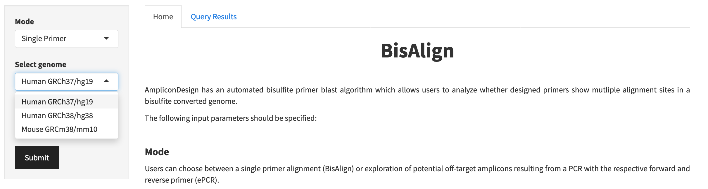

 

### Introduction to BisAlign

The alignment of designed primers against a reference genome is an important task to ensure the specificity and binding efficacy. This quality control step becomes even more important when working with bisulfite treated DNA as the conversion of cytosins to uracil (and later thymin after PCR amplification) lowers the complexity of the underling sequence from a 4- to a 3-letter code. Therefore, we have implemented BisAlign, a [Bowtie](https://genomebiology.biomedcentral.com/articles/10.1186/gb-2009-10-3-r25) based short sequence alignment tool which allows the *in-silico* alignment of primer sequences against a bisulfite converted genome.
 
 

### Tutorial: Primer alignment using BisAlign 

 

#### 1.) Select the required genome build
AmpliconDesign currently supports three common genome builds: GRCh38/hg38, GRCh27/hg19 and GRCm38/mm10.  
Select the required genome in the drop-down menu. 

 
 

#### 2.) Enter the primer sequence
Please enter the primer sequence which you want to align agains the bisulfite converted reference genome.  

*Note:*  You can just enter sequences with standard bases ACGT. For unknwon bases use N. 

 
 

#### 3.) Results section
The alignment results are shown as a table sorted based on the "top alignment score". The strand column indicates on which strand a primer alignment was detected. The alignment position is given as chromosome and start of the binding sequence. The primer sequence or the reverse complement which was used for alignment is repeated in the sequence column. The mismatch to the primer sequence at a potential off-target binding sites is shown in the last column.
 

 

