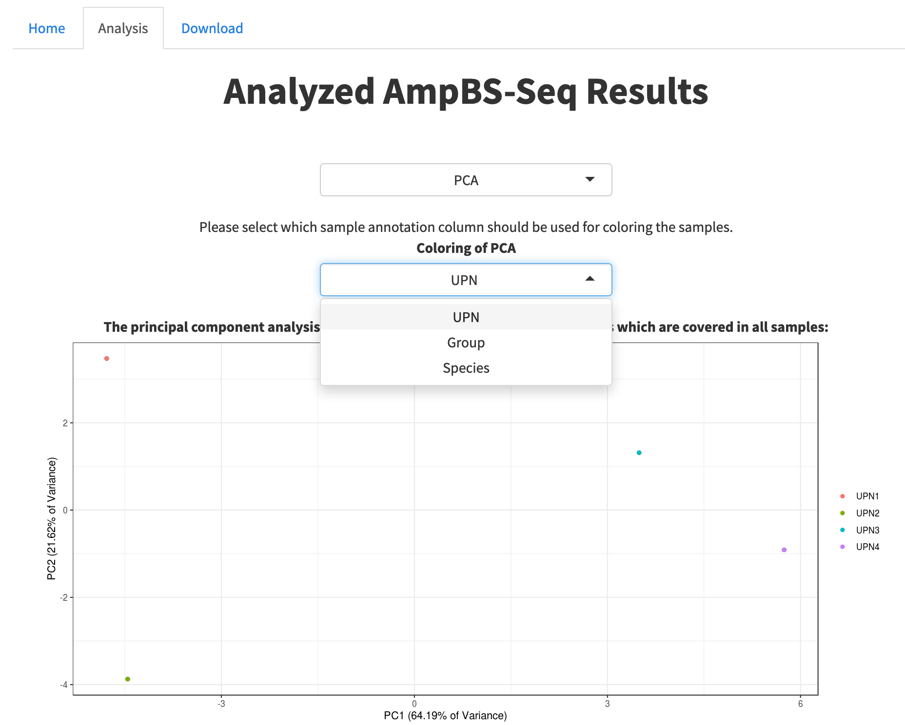

<style>
body {
text-align: justify}
</style>

<br>

### Introduction to the Analysis Pipeline

The analysis of ampBS-seq data requires adapter trimming, read alignment and methylation calling. Subsequent output files contain the number of methylated and unmethylated reads for each CpG sites. *AmpliconDesign* offers an [out-of-the-box pipeline](https://github.com/HeyLifeHD/amplicon_bisulfite_seq_pipeline/) supporting each of these steps. Moreover, Bismark coverage files which are produced by the pipeline can be uploaded to the *AmpliconDesign* webserver for an interactive quality control and analysis. The following tutorial guides you through all the necessary steps of a successful ampBS-seq analysis workflow.
<br>
<br>

### Tutorial: Analyzing ampBS-seq results using AmpliconDesign

<br>

#### 1.) Install and configure the Snakemake pipeline
The snakemake pipeline can be simpely downloaded from github using a single command in the unix shell:
```{cmd eval=FALSE, include=TRUE}
$ git clone https://github.com/HeyLifeHD/amplicon_bisulfite_seq_pipeline/
```

<br>

Open the **config.yaml** file in the "amplicon_bisulfite_seq_pipeline" directory using your favorite editor.  
<br>


<br>
Set the paths for your working directory (make sure you have rights to write), Bismark reference genome and files for the R analysis pipeline which can be used optional. 
<br>


<br>

Last create an folder called **01_fastq_raw** in the working directory in which you move the .fastq files to be processed.
```{cmd eval=FALSE, include=TRUE}
$ mkdir 01_fastq_raw
```

<br>

#### 2.) Run the Snakemake pipeline
All you need to execute this pipeline is to install [Snakemake](https://snakemake.readthedocs.io/en/stable/) via the Conda package manager (for more information please refer to the Snakemake documentation). Software needed by this workflow is automatically deployed into isolated environments by Snakemake.
```{cmd eval=FALSE, include=TRUE}
$ conda install -c conda-forge -c bioconda snakemake
```

<br>

Test your configuration by performing a dry-run via:
```{cmd eval=FALSE, include=TRUE}
$ snakemake --use-conda -n
```

<br>

Execute the workflow locally via
```{cmd eval=FALSE, include=TRUE}
$ snakemake --use-conda all
```

<br>


#### 3.) Upload files to the AmpliconDesign web server 
Sample meta data, analyzed regions and Bismark coverage (methylation information) files can be uploaded to the webserver. Please make sure that your files fulfill the following criteria:
<br>
*Sample Sheet:* The sample sheet must contain the exact file names to which the meta data is assigned in a first column. Furthermore a column "UPN" specifying a unique identifier for each sample is required. <br>

*Regions:* Genomic coordinates tab-separated in a common bed-file format (Chromosome, Start, End).

*Bismark coverage files (.cov):* Exact Bismark coverage-file (.cov) output (Chromosome, Start, End, Methylation Percentage, Methylated Reads, Unmethylated Reads). Multiple files can be uploaded. The file names have to match to the first column in the meta data file.

*Coverage Cut-Off:* CpG sites with less reads will be excluded from the downstream analysis.


<br>

#### 4.) Overview of the uploaded data
The **Overview** tab shows information about the uploaded data. The coverage information for each sample is calculated in given in a table. 
"Covered CpG" counts the number of CpG sites retrieved from the Bismark .cov-files. 


<br>

#### 5.) Quality Control
The **Quality Control** and **QC Filtered** tabs allow information about the data quality. In the **QC Filtered** data, the coverage cut-off has been applied whereas **Quality Control** gives a general overview without filtering.


<br>

#### 6.) PCA
A principal component analysis (PCA) can be computed. Users can choose which meta data column should be used for coloring of the samples in the two-dimensional space. Common CpG sites after coverage filtering are used for PCA.



<br>

#### 7.) Heatmap
Common CpG sites after coverage filtering can be visualized in a heatmap. Users can choose whether to cluster rows or column, show column and row names, annotate meta data as column labels or change the colore scheme. Clustering is performed using hierarchical clustering (Method: Complete, Distance: Euclidean).


<br>

#### 8.) Region
The methylation levels for all CpG sites in an uploaded region can be inspected. Not covered CpG sites are marked in grey. For this view, CpG sites are ordered based on their genomic location. The coverage filter can be applied optionally. 


<br>